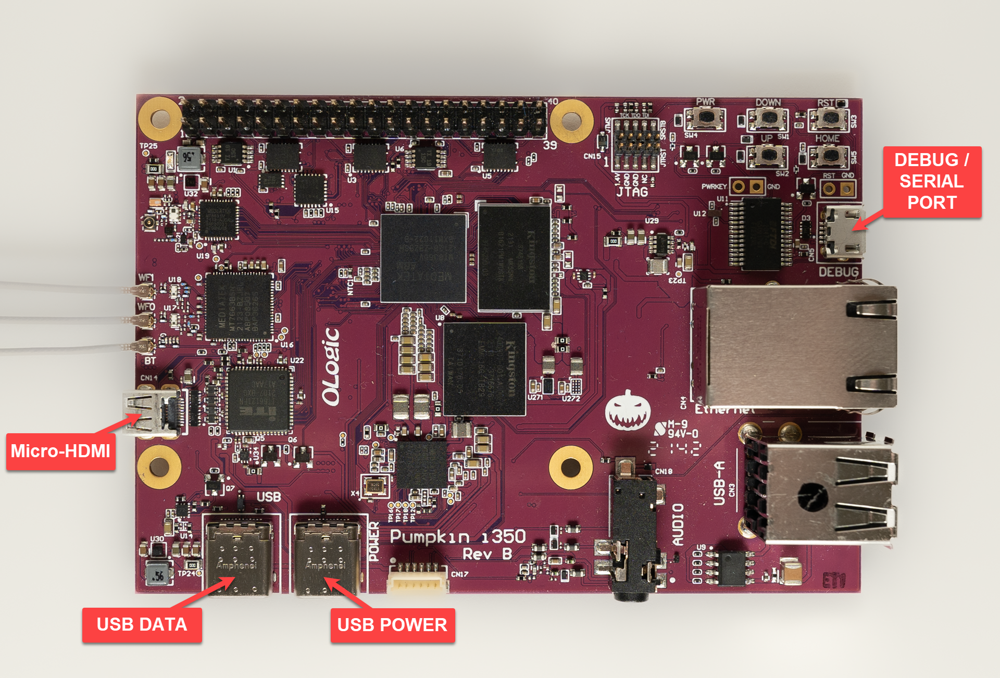
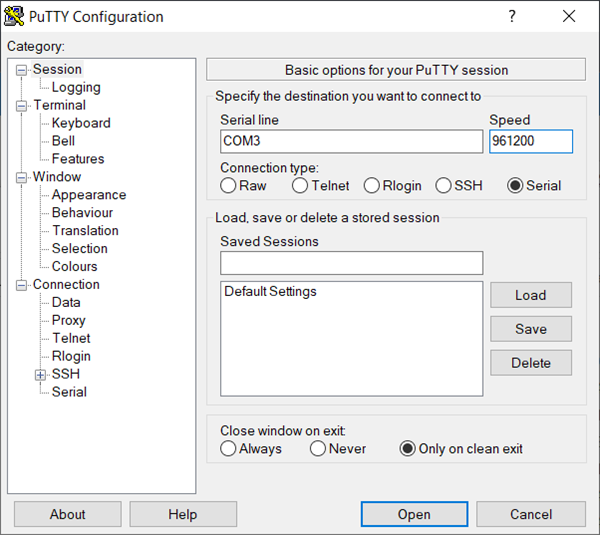
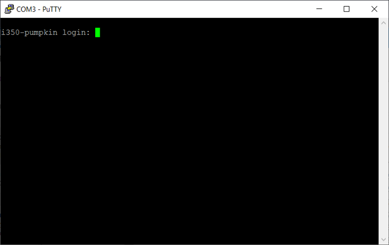
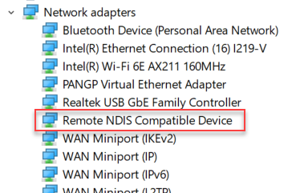
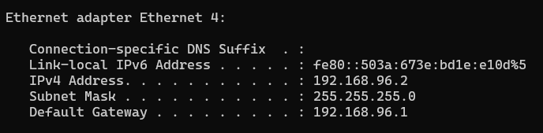
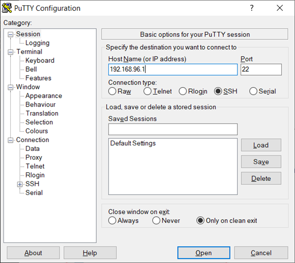
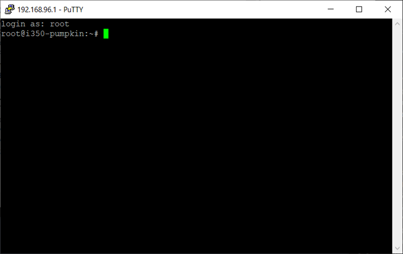
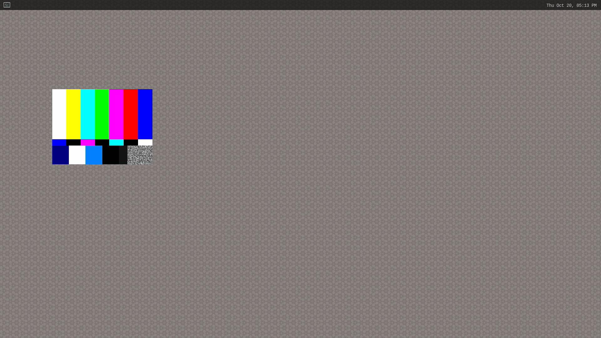
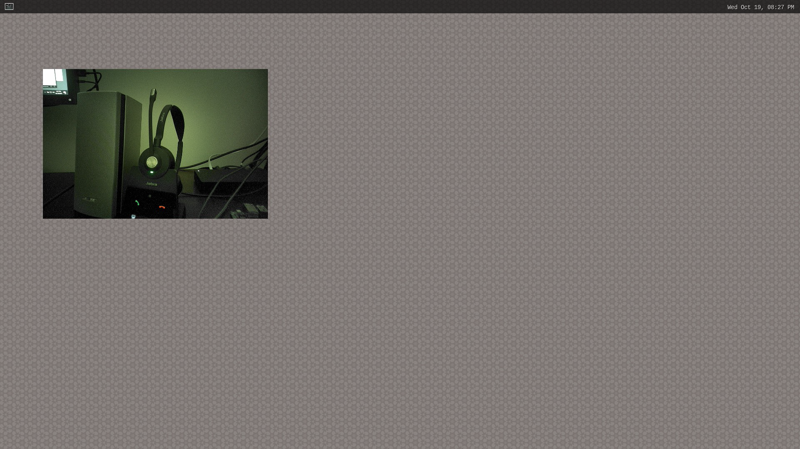

# Pumpkin Boards - Getting Started
 
This getting started tutorial is for [Pumpkin boards](https://ologicinc.com/portfolio_categories/mediatek/) designed by [Ologic Inc.](https://ologicinc.com/) using [Mediatek's Genio IoT](https://www.mediatek.com/products/internet-of-things/iot/industrial-iot) processors.

**Table of Contents**

- [Pumpkin Boards - Getting Started](#pumpkin-boards---getting-started)
  - [Requirements](#requirements)
    - [Hardware](#hardware)
    - [Software](#software)
  - [Getting Started](#getting-started)
    - [Using serial console](#using-serial-console)
      - [PuTTY serial connection](#putty-serial-connection)
    - [SSH](#ssh)
      - [SSH clients](#ssh-clients)
      - [Putty SSH connection](#putty-ssh-connection)
    - [Video Out](#video-out)
    - [Camera](#camera)
    - [Wifi](#wifi)
  - [Development](#development)
    - [Setup Tools](#setup-tools)
    - [Yocto build from Source Code](#yocto-build-from-source-code)
    - [Build for a specific Pumpkin Board](#build-for-a-specific-pumpkin-board)

## Requirements

### Hardware

Hardware requirements for working with Pumpkin boards.

- Needed:
  - 1 USB type-c power adapter able to provide 15W
  - 1 USB type-c data cable
  - 1 USB micro-b cable (for serial console)
  - 3 Wifi/Bluetooth antennas
- Optional:
  - keyboard, mouse, and monitor
  - micro-hdmi to hdmi cable
  - Cameras
    - generic USB camera (example Logitech web camera)
    - [Pumpkin ISP Camera Adapter](https://ologic.store/products/pumpkin-isp)
    - [AR0330 Camera](https://ologic.store/products/ar0144)
    - [AR0144](https://ologic.store/products/ar0144)

### Software

The Pumpkin Boards ship with software already installed allowing for a quick evaluation.

Yocto projects can be build, see the [Development Section](#development).

## Getting Started



### Using serial console

The serial console is on the USB port labeled DEBUG and must be connected to the computer for access.

The serial connect settings are:

```text
- Speed         : 921600
- Data          : 8 bit
- Parity        : none
- Stop bits     : 1 bit
- Flow control  : none
```

Examples of programs that can be used to connect to the serial port:

- Windows:
  - [PuTTY - https://www.putty.org](https://www.putty.org/)
  - [TeraTerm - https://ttssh2.osdn.jp](https://ttssh2.osdn.jp/)
- Linux:
  - [PuTTY - https://www.putty.org](https://www.putty.org/)
  - minicom
    ```text
    Ubuntu install:

    sudo apt install minicom
    ```

#### PuTTY serial connection

1. Putty configuration screen for serial connection. Note the com port number will vary from pc to pc, check Windows device manager to ensure the correct com port number is used.

   

2. Putty connection screen for serial connection

   

### SSH

The software demo images come with RNDIS enabled. This allows for IP to IP communication between the PC and the Genio board. The USB DATA type-c connector must be connected to the computer for access.

If setup correctly the following will show up in the Windows device manager:
  
  

The RNDIS adapter will show up when performing a ipconfig in a Windows terminal:

  

Troubleshooting RNDIS: [https://mediatek.gitlab.io/aiot/doc/aiot-dev-guide/sw/yocto/get-started/connect/rndis-windows.html](https://mediatek.gitlab.io/aiot/doc/aiot-dev-guide/sw/yocto/get-started/connect/rndis-windows.html)  

#### SSH clients

Both Putty and TeraTerm can be used for SSH clients.

#### Putty SSH connection

1. Putty configuration screen

   

2. Putty connected screen

   

### Video Out

1. The micro HDMI connector can be used with a monitor and will show the following GUI. A keyboard and mouse can be used on the Pumpkin boards.

   To launch a test pattern on the display:

   ```text
   gst-launch-1.0 --verbose &>> Vidout.out videotestsrc ! waylandsink 
   ```

   

### Camera

1. Ensure the [Pumpkin ISP Camera Adapter](https://ologic.store/products/pumpkin-isp) is attached to the Pumpkin board and camera is attached correctly.

   

2. Ensure correct overlay is installed for the camera selected at flashing. To check the overlay currently installed, enter uboot and check the env variable 'boot_conf'.

   Below is example of overlay for a single AR0330 camera. Ensure to hit a key when uboot shows 'Hit any key to stop autoboot' and then use the 'printenv boot_conf' command to show the dtbo's loading.

   ```text
   U-Boot 2022.04 (Jul 06 2022 - 06:43:08 +0000)

   CPU:   MediaTek MT8365
   DRAM:  1 GiB
   Core:  14 devices, 11 uclasses, devicetree: separate
   WDT:   Started watchdog@10007000 with servicing (60s timeout)
   MMC:   mmc@11230000: 0
   Loading Environment from MMC... OK
   Warning: device tree node '/config/environment' not found
   In:    uart0@11002000
   Out:   uart0@11002000
   Err:   uart0@11002000
   Net:   eth0: usb_ether
   Hit any key to stop autoboot:  0
   => printenv boot_conf
   boot_conf=#conf-mediatek_mt8365-pumpkin.dtb#conf-camera-ap1302-ar0330-single.dtbo
   =>
   ```

   How to load dtbo: [https://mediatek.gitlab.io/aiot/doc/aiot-dev-guide/tools/aiot-tools.html#load-a-dtbo](https://mediatek.gitlab.io/aiot/doc/aiot-dev-guide/tools/aiot-tools.html#load-a-dtbo)

3. Run the following command from the serial console:

   Using the AR0330 camera:

   ```text
   gst-launch-1.0 --verbose &>> libcam.out libcamerasrc camera-name="/base/soc/i2c@1100f000/camera@3c" ! v4l2convert ! video/x-raw,width=1280,height=360 ! waylandsink
   ```

   Using a generic USB camera:

   ```text
   gst-launch-1.0 --verbose &>> Vidin4.out v4l2src device=/dev/video4 ! v4l2convert ! waylandsink
   ```

   

### Wifi

1. Show wireless information

   ```text
    root@i350-pumpkin:~# iw dev
    phy#0
            Interface ap0
                    ifindex 5
                    wdev 0x3
                    addr 6a:b6:0f:6e:52:e6
                    type managed
            Interface p2p0
                    ifindex 4
                    wdev 0x2
                    addr 02:08:22:8c:7c:fb
                    type P2P-client
            Interface wlan0
                    ifindex 3
                    wdev 0x1
                    addr d2:88:7b:1d:c0:ff
                    type managed
    root@i350-pumpkin:~#
   ```

2. Connect to an Access Point

   This command creates a connection to wifi ssd "test" with a password of "password" and is saved in a profile (con-name) as "test".

   ```text
   nmcli con add con-name "test" ifname wlan0 type wifi ssid "test" wifi-sec.key-mgmt wpa-psk wifi-sec.psk 'password'
   ```

3. Once the profile is created bring the connection up:

   ```text
   nmcli con up "test"
   ```

4. Check connection link

   ```text
    root@i350-pumpkin:~# iw wlan0 link
    Connected to 38:94:ed:0f:d5:07 (on wlan0)
            SSID: test
            freq: 5220
            RX: 529769039 bytes (430529 packets)
            TX: 1421157261 bytes (949447 packets)
            signal: -51 dBm
            tx bitrate: 780.0 MBit/s
    root@i350-pumpkin:~#
   ```

5. Network connection test

   ```text
    root@i350-pumpkin:~# ping 8.8.8.8
    PING 8.8.8.8 (8.8.8.8) 56(84) bytes of data.
    64 bytes from 8.8.8.8: icmp_seq=1 ttl=56 time=37.8 ms
    64 bytes from 8.8.8.8: icmp_seq=2 ttl=56 time=31.8 ms
    64 bytes from 8.8.8.8: icmp_seq=3 ttl=56 time=32.2 ms
    64 bytes from 8.8.8.8: icmp_seq=4 ttl=56 time=29.8 ms
    ^C
    --- 8.8.8.8 ping statistics ---
    4 packets transmitted, 4 received, 0% packet loss, time 3004ms
    rtt min/avg/max/mdev = 29.756/32.890/37.812/2.987 ms
    root@i350-pumpkin:~#
   ```

6. iperf3 performance test

   The iperf3 tests are performed on a local network with a linux PC running an iperf3 server and the Pumpkin Board running as a client.

   ```text
    root@i350-pumpkin:~# iperf3 -c 10.0.0.3 -u -b 0
    Connecting to host 10.0.0.3, port 5201
    [  5] local 10.0.0.37 port 35378 connected to 10.0.0.3 port 5201
    [ ID] Interval           Transfer     Bitrate         Total Datagrams
    [  5]   0.00-1.00   sec  42.1 MBytes   353 Mbits/sec  30510
    [  5]   1.00-2.00   sec  46.8 MBytes   392 Mbits/sec  33880
    [  5]   2.00-3.00   sec  47.9 MBytes   402 Mbits/sec  34690
    [  5]   3.00-4.00   sec  48.3 MBytes   405 Mbits/sec  34950
    [  5]   4.00-5.00   sec  47.9 MBytes   402 Mbits/sec  34710
    [  5]   5.00-6.00   sec  48.1 MBytes   404 Mbits/sec  34840
    [  5]   6.00-7.00   sec  48.8 MBytes   410 Mbits/sec  35350
    [  5]   7.00-8.00   sec  48.1 MBytes   403 Mbits/sec  34820
    [  5]   8.00-9.00   sec  48.9 MBytes   411 Mbits/sec  35440
    [  5]   9.00-10.00  sec  47.3 MBytes   397 Mbits/sec  34270
    - - - - - - - - - - - - - - - - - - - - - - - - -
    [ ID] Interval           Transfer     Bitrate         Jitter    Lost/Total Datagrams
    [  5]   0.00-10.00  sec   474 MBytes   398 Mbits/sec  0.000 ms  0/343460 (0%)  sender
    [  5]   0.00-10.01  sec   474 MBytes   398 Mbits/sec  0.035 ms  0/343459 (0%)  receiver

    iperf Done.
    root@i350-pumpkin:~# iperf3 -c 10.0.0.3 -u -b 0 -R
    Connecting to host 10.0.0.3, port 5201
    Reverse mode, remote host 10.0.0.3 is sending
    [  5] local 10.0.0.37 port 43200 connected to 10.0.0.3 port 5201
    [ ID] Interval           Transfer     Bitrate         Jitter    Lost/Total Datagrams
    [  5]   0.00-1.00   sec  40.6 MBytes   340 Mbits/sec  0.006 ms  49929/79310 (63%)
    [  5]   1.00-2.00   sec  49.5 MBytes   415 Mbits/sec  0.017 ms  46863/82713 (57%)
    [  5]   2.00-3.00   sec  45.4 MBytes   381 Mbits/sec  0.018 ms  48097/80957 (59%)
    [  5]   3.00-4.00   sec  47.4 MBytes   398 Mbits/sec  0.035 ms  48969/83295 (59%)
    [  5]   4.00-5.00   sec  50.0 MBytes   419 Mbits/sec  0.107 ms  45725/81916 (56%)
    [  5]   5.00-6.00   sec  44.2 MBytes   371 Mbits/sec  0.030 ms  49936/81969 (61%)
    [  5]   6.00-7.00   sec  46.0 MBytes   386 Mbits/sec  0.023 ms  48191/81513 (59%)
    [  5]   7.00-8.00   sec  46.9 MBytes   393 Mbits/sec  0.107 ms  49137/83064 (59%)
    [  5]   8.00-9.00   sec  47.3 MBytes   397 Mbits/sec  0.054 ms  47937/82202 (58%)
    [  5]   9.00-10.00  sec  48.1 MBytes   403 Mbits/sec  0.078 ms  47314/82140 (58%)
    - - - - - - - - - - - - - - - - - - - - - - - - -
    [ ID] Interval           Transfer     Bitrate         Jitter    Lost/Total Datagrams
    [  5]   0.00-10.02  sec  1.11 GBytes   951 Mbits/sec  0.000 ms  0/823250 (0%)  sender
    [  5]   0.00-10.00  sec   465 MBytes   390 Mbits/sec  0.078 ms  482098/819079 (59%)  receiver

    iperf Done.
   ```

## Development

Mediatek supports Yocto and the developer guide can be found here:
https://mediatek.gitlab.io/aiot/doc/aiot-dev-guide/index.html

### Setup Tools

The setup tools are needed for flashing the Pumpkin boards. Guides from Mediatek are provided below.

- Linux
[https://mediatek.gitlab.io/aiot/doc/aiot-dev-guide/sw/yocto/get-started/env-setup/flash-env-linux.html](https://mediatek.gitlab.io/aiot/doc/aiot-dev-guide/sw/yocto/get-started/env-setup/flash-env-linux.html)

- Windows
[https://mediatek.gitlab.io/aiot/doc/aiot-dev-guide/sw/yocto/get-started/env-setup/flash-env-windows.html](https://mediatek.gitlab.io/aiot/doc/aiot-dev-guide/sw/yocto/get-started/env-setup/flash-env-windows.html)

### Yocto build from Source Code

[https://mediatek.gitlab.io/aiot/doc/aiot-dev-guide/sw/yocto/get-started/build-code.html](https://mediatek.gitlab.io/aiot/doc/aiot-dev-guide/sw/yocto/get-started/build-code.html)

### Build for a specific Pumpkin Board

When building Yocto for Pumpkin boards ensure the correct MACHINE is set.

```text
For i350 use:

DISTRO=rity-demo MACHINE=i350-pumpkin bitbake rity-demo-image

For i500 use:

DISTRO=rity-demo MACHINE=i500-pumpkin bitbake rity-demo-image

```
